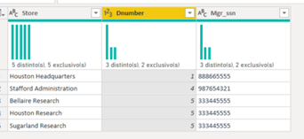

## Conclusão do desafio 3 do BootCamp de Power BI da DIO.

### Diferenças de que devem ser analisadas ao utilizar o comando "mesclar consultas" e "acrescentar consultas"

Quando utilizamos o comando **mesclar consultas** iremos selecionar iremos selecionar primeiramente a tabela que será a referência para este processo, e logo em seguida selecionaremos a tabela ao qual iremos agregar colunas à primeira tabela (tabela referência). Para que este processo possa ser validado é necessário que haja uma coluna em comum entre ambas as tabelas que estão envolvidas no processo. Contudo é primordial observar que caso as duas tabelas não possuam as mesmas quantidades de linha poderá no ato da fusão gerar celulas com o conteúdo **null** ou **vazio**.
Então, se a sua intensão é juntar dados de duas colunas distintas em uma, utilize a função **mesclar consultas**, pois utilizando esta função as novas células irão agrupar lateralmente a tabela referência.

A função **acrescentar consultas** deve ser utilizada com muita cautela, pois neste processo não há necessidade de haver coluna em comum entre as duas tabelas para a agregação da informação, ao selecionar a primeira tabela, essa será a referência, e a tabela selecionada posteriormente terá as suas colunas ausentes na primeira tabela, incluida na mesma.
Neste momento foram construídas as colunas da tabela condensada que está sendo criada. Agora é que vem a parte importante, os dados da primeira tabela permanecerão conforme estão dispostos, e os dados da segunda tabela irão ser adicionados logos abaixo dos dados da primeira tabela.
Contudo, caso os campos das tabelas não sejam idênticos irá gerar uma tabela com muitos problemas, apresentando diversas células em **banco** e com **null**
Tome muito cuidado ao ultilizar esta função.

